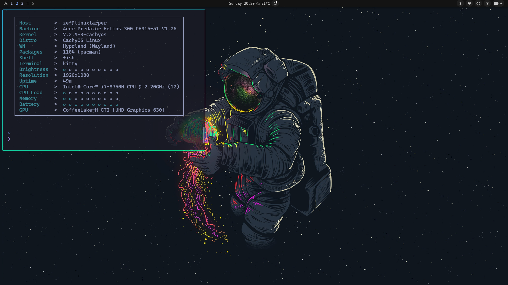

# 🌌 Dotfiles — Tokyo Night Hyprland Rice

<p align="center">
  
</p>

<p align="center">
  
  
  
  
  
</p>

A clean, minimalist **Tokyo Night** desktop setup on **CachyOS / Arch Linux**, powered by **Hyprland** (configured in native Lua), **Noctalia** shell, and **UWSM** session manager.

---

## 🎨 Overview & Components

| Component | Software | Details |
| :--- | :--- | :--- |
| **OS** | [CachyOS](https://cachyos.org) / Arch Linux | Linux kernel with x86-64-v3/v4 optimizations |
| **Compositor** | [Hyprland](https://hyprland.org) | Modern Wayland compositor configured with native Lua |
| **Session Manager** | [UWSM](https://github.com/Vladimir-csp/uwsm) | Clean systemd-managed Wayland session |
| **Status Bar & Shell** | [Noctalia](https://github.com/noctalia-dev/noctalia) | Widgets, application launcher, notifications & volume/battery capsules |
| **Terminal** | [Kitty](https://sw.kovidgoyal.net/kitty/) / [Alacritty](https://alacritty.org) | Tokyo Night color scheme with transparency and custom fonts |
| **Editor** | [Neovim](https://neovim.io/) | Fast, modular Lua setup powered by lazy.nvim |
| **Screenshot Tool** | [Satty](https://github.com/gabm/satty) | On-screen annotation and screenshot utility |
| **Font** | CaskaydiaMono Nerd Font | Crisp ligatures and terminal glyphs |
| **Wallpaper** | [Astronaut Artwork](https://www.wallpaperflare.com/astronaut-space-black-background-artwork-wallpaper-gjfku) | Minimalist space artwork via WallpaperFlare |

---

## ⌨️ Common Keybindings

`SUPER` is mapped to the **Windows** key.

### Applications & Menus
| Shortcut | Action |
| :--- | :--- |
| `Super + Return` | Open Terminal (`kitty` / `alacritty`) |
| `Super + Space` | Open Application Launcher (Noctalia) |
| `Super + E` | Open File Manager (`dolphin`) |
| `Super + Shift + Return` | Open Web Browser (`firefox`) |
| `Super + Shift + N` | Open Code Editor (`nvim`) |
| `Super + Escape` | Open Power & Session Menu |
| `Super + K` | Show Keybindings Cheat Sheet |

### Window Management
| Shortcut | Action |
| :--- | :--- |
| `Super + W` or `Super + Q` | Close Active Window |
| `Super + T` | Toggle Floating / Tiling |
| `Super + F` | Toggle Fullscreen |
| `Super + J` | Toggle Window Split Direction |
| `Super + O` | Pop Window Out (Float & Pin) |
| `Ctrl + Alt + Delete` | Close All Windows |

### Utilities & Toggles
| Shortcut | Action |
| :--- | :--- |
| `Super + C` / `Super + V` | Universal Copy / Paste |
| `Super + Ctrl + V` | Open Clipboard Manager |
| `Super + Shift + Space` | Toggle Top Bar |
| `Super + Ctrl + Space` | Open Wallpaper Switcher |
| `Super + Shift + Backspace` | Toggle Window Gaps |
| `Super + Backspace` | Toggle Window Opacity |
| `Print` | Fullscreen Screenshot |
| `Alt + Print` | Region Screenshot |
| `Super + Print` | Color Picker (`hyprpicker`) |

---

## 📂 Repository Structure

```text
dotfiles/
├── alacritty/       # Alacritty terminal configuration & Tokyo Night theme
├── hypr/            # Hyprland native Lua configs, window rules, keybinds & scripts
├── kitty/           # Kitty terminal emulator configuration
├── noctalia/        # Noctalia status bar, launcher widgets & appearance
├── nvim/            # Neovim configuration (Lazy.nvim setup)
├── satty/           # Satty screenshot annotation tool config
├── uwsm/            # UWSM environment variables & startup flags
├── preview.png      # Desktop showcase screenshot
├── INSTALL.md       # Comprehensive installation & package restoration guide
└── README.md        # Rice showcase & reference guide
```

---

## 🚀 Quick Setup

1. **Clone the repository**:
   ```bash
   git clone git@github.com:surajklmn/dotfiles.git ~/Projects/dotfiles
   cd ~/Projects/dotfiles
   ```

2. **Symlink configs to `~/.config/`**:
   ```bash
   for app in alacritty hypr kitty noctalia satty uwsm; do
       ln -sf ~/Projects/dotfiles/"$app" ~/.config/"$app"
   done
   ```

3. **Install dependencies**:
   See [`INSTALL.md`](INSTALL.md) for full package lists, font configurations, and machine-specific tweaks.
